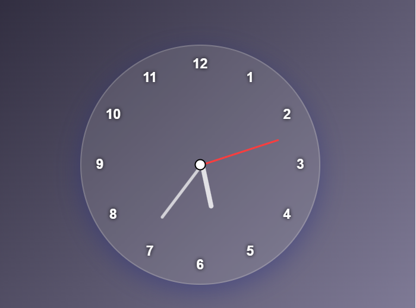

# Glassy Analog Clock ⏰

A beautifully designed analog clock built using **HTML**, **CSS**, and **JavaScript**. The clock features a **glassmorphism UI**, real-time hand movement, and dynamically positioned hour numbers for a modern and interactive design.

---

## 🖼️ Preview

  
<sub>*Add a screenshot named `screenshot.png` to the root directory to display the preview.*</sub>

---

## 🔧 Features

- ⏱ Real-time analog clock
- 💅 Glassmorphism styling using CSS `backdrop-filter`
- 🧠 Hour numbers (1–12) are added dynamically with JS
- 📐 Smooth and accurate hand rotation for hours, minutes, and seconds

---

## 📁 Project Structure

```
📦 glassy-analog-clock
├── index.html       # Main HTML structure
├── style.css        # Styles for layout and effects
├── script.js        # Logic to update clock and render numbers
└── README.md        # Project documentation
```

---

## 🚀 How to Run

1. **Clone or Download the Repository**

   ```bash
   git clone https://github.com/yourusername/glassy-analog-clock.git
   ```

2. **Open the Project**

   - Navigate to the downloaded folder
   - Double-click `index.html` to open it in your browser

---

## 🧠 How It Works

- **HTML (`index.html`)**: Basic structure with elements for clock hands and center.
- **CSS (`style.css`)**: Applies modern glassmorphism UI, positioning, shadows, and animation effects.
- **JavaScript (`script.js`)**:
  - Dynamically places numbers (1–12) around the clock using trigonometry.
  - Rotates the second, minute, and hour hands in real-time using `setInterval()` and `Date`.

---

## 📸 Screenshot
 `screenshot.png`.


---

## 📄 License

This project is open-source and free to use for personal and educational purposes.

---

## 👤 Author

**Mansoor Ahmed**  
_Developer & Educator_

